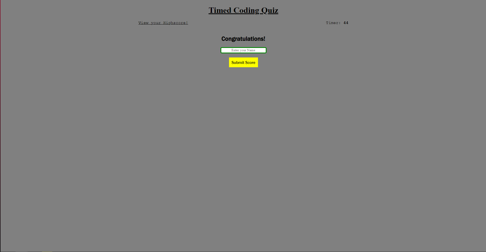
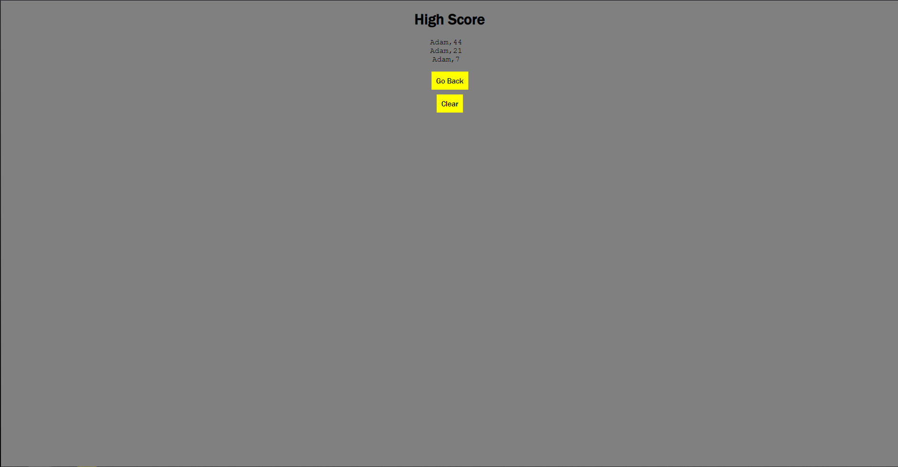
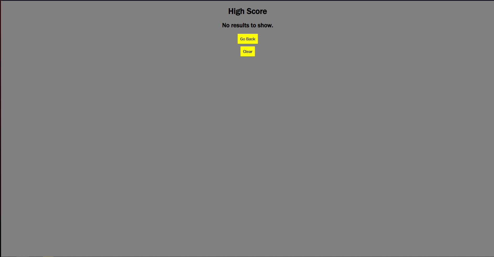

## Coding Quiz Homework week 4

### Description

This week we were tasked with fully writing a Coding Quiz for a user story, the quiz must be based on Coding and I had to use my skills in HTML, CSS and Javascript in order to complete this task.

Throughout this homework we were tasked with creating a website from the ground up, using all the knowledge from the past 5 weeks of learning.

### Screenshots

Screenshot 1: Main Page

On the home page, once you click 'Start Quiz' the first question will be prompted to answer, seen below is what happens if you answer the question wrong:

Screenshot 2: Incorrect Answer

Every Incorrect Answer deducts 10 points(seconds) from your score

If all questions are answered Correctly you will be promoted to enter your name in order to save your score as seen in the screenshot below:

Screenshot 3: Submit Score

Once you've entered your name, you high scores will be entered into an array, placing the highest score at the top.
An option to clear scores is also given prompting a "No results to show." prompt.

Screenshot 4: High Score Array

Screenshot 5: No Results to Show

### Link to Deployed Application

https://kingarthur0877.github.io/homework_4/index.html
